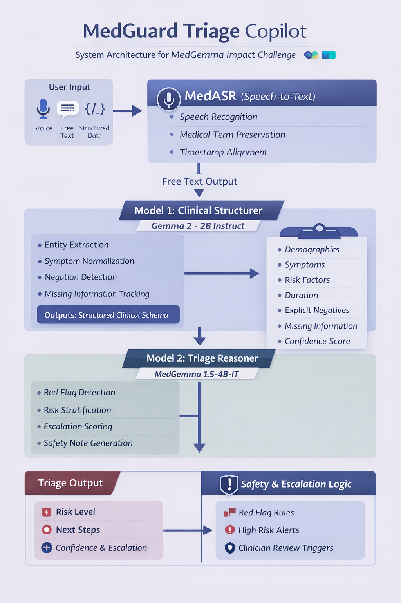

# 🏥 MedGuard Triage Copilot

### Agentic, Multimodal Clinical Triage — Powered by Google's Health AI Stack

> **Submission for the [Google MedGemma Impact Challenge](https://www.kaggle.com/competitions/med-gemma-impact-challenge/overview)**

[](https://ai.google.dev/gemma/docs/medgemma)
[](https://ai.google.dev/gemma)
[](https://huggingface.co/google/medasr)
[](https://cloud.google.com/vertex-ai)

---

## TL;DR for Judges

MedGuard is a **production-ready, safety-first triage copilot** that takes any patient intake — voice, free text, or structured data — and outputs a **clinically-grounded urgency assessment** in seconds. It chains **three Google Health AI models** in a decoupled pipeline where a **deterministic safety layer can never be overridden by model output**.

**Core differentiators:**

- 🔗 **3-stage pipeline** — MedASR → Gemma 2-2B → MedGemma 4B-IT — each model does one job well
- 🛡️ **Rule-based safety net** — Red-flag engine runs *independently* of models — critical patterns are **never missed**
- 🚨 **Fail-safe by design** — Any model failure defaults to **Urgent** and routes to a clinician
- 📊 **Uncertainty-aware** — Confidence scores propagate end-to-end; low-confidence outputs auto-escalate
- 🎙️ **Multimodal input** — Voice (via MedASR), free text, or pre-structured JSON

---

## Architecture

```
 PATIENT INPUT
 ─────────────
   Voice │ Text │ Structured JSON
         │      │
         ▼      │
┌──────────────┐│
│  Stage 1     ││     ┌──────────────────┐     ┌─────────────────────┐
│  MedASR      │├────▶│  Stage 2         │────▶│  Stage 3            │
│  (105M)      ││     │  Gemma 2-2B      │     │  MedGemma 4B-IT     │
│  Speech→Text ││     │  Text→Structured │     │  Structured→Triage  │
└──────────────┘│     └────────┬─────────┘     └────────┬────────────┘
                │              │                        │
                │     ┌────────▼─────────┐     ┌────────▼────────────┐
                │     │  Uncertainty     │     │  Red Flag Engine    │
                │     │  Engine          │     │  (Rule-based)       │
                │     └──────────────────┘     │  + Risk Scorer      │
                │                              └─────────────────────┘
                │                                       │
                │              ┌─────────────────────────┘
                ▼              ▼
         ┌──────────────────────────┐
         │  FINAL TRIAGE OUTPUT     │
         │  Urgency 1–5 + Actions   │
         │  + Confidence + Red Flags│
         └──────────────────────────┘
```



### Google Models Used

| Stage | Model | Params | Role | Infra |
|:-----:|-------|-------:|------|-------|
| 1 | **Google MedASR** | 105M | Medical speech-to-text (Conformer CTC) | Local (PyTorch) |
| 2 | **Gemma 2-2B Instruct** | 2B | Clinical entity extraction, negation detection | Ollama (local) |
| 3 | **MedGemma 4B-IT** | 4B | Safety-focused triage reasoning & risk scoring | Vertex AI |

### Safety-First Design

| Principle | How it works |
|-----------|-------------|
| **Never miss a red flag** | Deterministic keyword engine scans every input for 50+ clinical red-flag patterns across 8 categories (cardiac, stroke, respiratory, hemorrhage, neurological, sepsis, psychiatric, pediatric) — runs in parallel with models, can only *upgrade* urgency |
| **Fail-safe defaults** | If any model errors or returns invalid output, the system defaults to **Level 4 (Urgent)** and routes to a human clinician |
| **Uncertainty propagation** | Extraction confidence × triage confidence = blended score; anything below 0.4 triggers automatic senior-review escalation |
| **Decoupled reasoning** | Language understanding (Stage 2) is separated from medical reasoning (Stage 3) — errors in one don't cascade silently |

---

## Live Demo (Gradio UI)

```bash
python launch_ui.py
```

The interactive UI supports:
- **Free-text input** — type or paste any patient complaint
- **Voice input** — record or upload audio (routed through MedASR)
- **Structured JSON** — paste pre-structured clinical data
- **Follow-up interaction** — ask clarifying questions after triage

Output includes: urgency badge (1–5), red-flag alerts with categories, confidence bar, escalation recommendation, reasoning summary, and follow-up questions.

---

## Quick Start

```bash
# 1. Clone & setup
git clone <repo-url> && cd medguard-triage-copilot
python -m venv medgemma && source medgemma/bin/activate
pip install -r requirements.txt

# 2. Configure environment
cp .env.example .env   # Add HF_API_TOKEN, GOOGLE_CLOUD_PROJECT

# 3. Launch Gradio UI
python launch_ui.py

# 4. Or use CLI
python main.py "58yo male, crushing chest pain 45min, smoker, diaphoretic"

# 5. Or start REST API
uvicorn api.main:app --reload --port 8000
```

---

## Project Structure

```
medguard-triage-copilot/
├── app/
│   ├── gradio_app.py             # Gradio interactive UI (primary frontend)
│   ├── triage_engine.py          # Backward-compat re-exports
│   └── safety.py                 # Safety component re-exports
├── models/
│   ├── asr/medasr_wrapper.py     # Stage 1: Google MedASR
│   ├── extraction/
│   │   ├── gemma_structurer.py   # Stage 2: Gemma clinical structurer
│   │   ├── schema_definition.py  # Pydantic schemas
│   │   └── uncertainty_engine.py # Confidence & gap analysis
│   └── triage/
│       ├── medgemma_reasoner.py  # Stage 3: MedGemma triage (Vertex AI)
│       ├── red_flag_engine.py    # Deterministic red-flag scanner
│       └── risk_scorer.py        # Final risk scoring & overrides
├── pipelines/
│   ├── voice_pipeline.py         # Audio → ASR → Structure → Triage
│   ├── text_pipeline.py          # Text → Structure → Triage
│   └── structured_pipeline.py    # Structured JSON → Triage only
├── core/
│   ├── router.py                 # Auto-routing entrypoint
│   ├── validation.py             # Schema validation
│   └── logging_utils.py          # Structured logging
├── configs/
│   ├── model_config.yaml         # Model IDs, endpoints, parameters
│   ├── safety_rules.yaml         # 50+ red-flag keywords & thresholds
│   └── escalation_policy.yaml    # Urgency → clinical action mapping
├── evaluation/
│   ├── triage_metrics.py         # Urgency accuracy, safety score
│   ├── extraction_metrics.py     # Completeness, recall, negation
│   └── benchmark_runner.py       # Batch evaluation runner
├── api/
│   ├── main.py                   # FastAPI REST API
│   └── schemas.py                # Request/response models
├── data/test_cases/              # High-risk, low-risk, edge-case suites
└── notebooks/
    └── triage_copilot_v1.ipynb   # Development & experimentation
```

---

## Evaluation

```python
from evaluation.benchmark_runner import load_test_cases, run_benchmark
from pipelines.text_pipeline import TextPipeline

pipeline = TextPipeline()
cases = load_test_cases("data/test_cases/high_risk_cases.json")
results = run_benchmark(pipeline, cases)
```

### Metrics

| Metric | What it measures |
|--------|-----------------|
| **Urgency accuracy** | Exact match on 1–5 urgency level |
| **Within-one accuracy** | Predicted urgency within ±1 of ground truth |
| **Red-flag recall** | Fraction of expected critical patterns detected |
| **Safety score** | Asymmetric — under-triage penalized **much** more than over-triage |
| **Extraction completeness** | % of clinical fields successfully extracted |

---

## Safety Features

| Feature | Detail |
|---------|--------|
| 🔴 **Rule-based Red Flags** | 50+ keywords across 8 clinical categories, independent of AI |
| ⬆️ **Urgency Override** | Red flags can only upgrade urgency — never downgrade |
| 🔒 **Fail-safe Default** | Any model failure → Level 4 (Urgent) + clinician routing |
| 📈 **Confidence Blending** | Extraction × triage confidence, propagated end-to-end |
| 🚨 **Low-confidence Escalation** | Blended score < 0.4 → automatic senior review flag |
| ⚠️ **Disclaimer** | Every output carries a non-diagnosis disclaimer |

---

## Environment Variables

| Variable | Required | Description |
|----------|:--------:|-------------|
| `HF_API_TOKEN` | ✅ | HuggingFace API token (model downloads) |
| `GOOGLE_CLOUD_PROJECT` | ✅ | GCP project for Vertex AI (Stage 3) |
| `STRUCTURER_ENDPOINT_URL` | — | Custom endpoint for Gemma structurer |
| `TRIAGE_ENDPOINT_URL` | — | Custom endpoint for MedGemma triage |
| `LOG_LEVEL` | — | Logging level (default: INFO) |

---

## Tech Stack

| Layer | Technology |
|-------|-----------|
| Models | Google MedASR · Gemma 2-2B · MedGemma 4B-IT |
| Inference | Vertex AI (Stage 3) · Ollama (Stage 2) · Local PyTorch (Stage 1) |
| Backend | FastAPI · Pydantic v2 |
| Frontend | Gradio 4 |
| Config | YAML (safety rules, escalation policies, model config) |
| Evaluation | Custom benchmark suite with safety-weighted metrics |

---

## Disclaimer

> ⚠️ **This is an AI-assisted triage tool built for the Google MedGemma Impact Challenge. It does NOT provide medical diagnoses. All outputs must be reviewed by qualified healthcare professionals. In emergencies, call emergency services immediately.**
